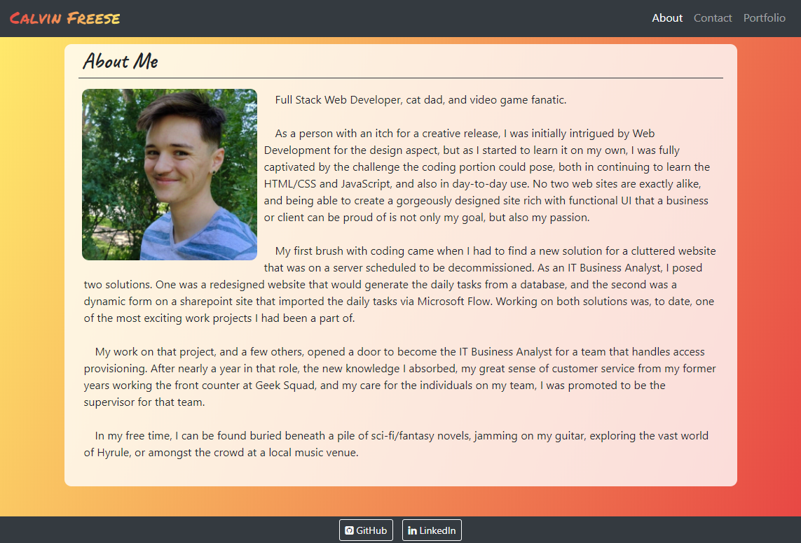
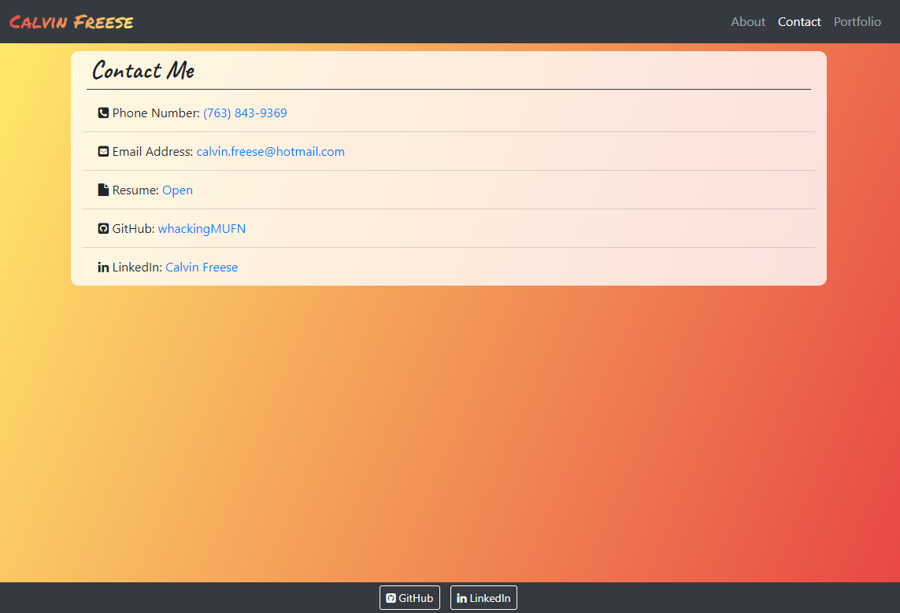
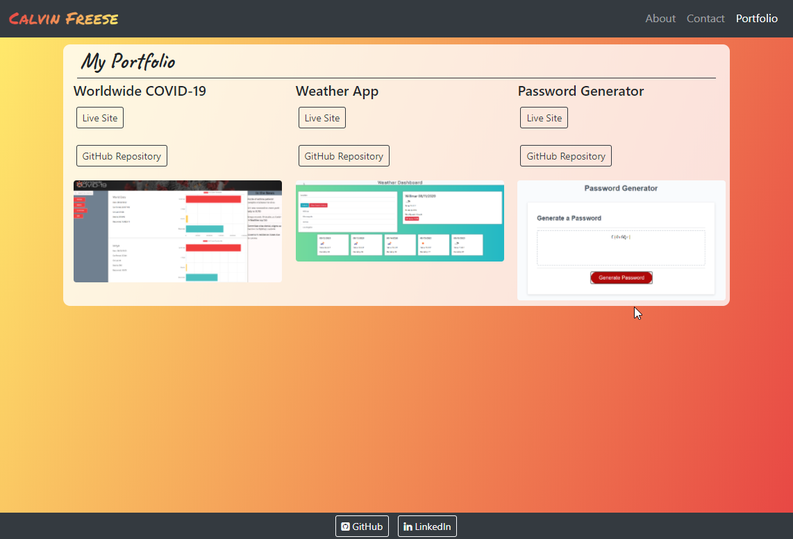

# My Responsive Portfolio

## Description

Bootstrap based layout designed to house my bio, portfolio, and contact information.
Portfolio includes the follow pages:
 * About Me
   * Contains bio and a photo of myself.
 * Contact Me
   * Contains phone number, email address, resume, and links to GitHub and LinkedIn.
 * Portfolio
   * Contains titles, links to live sites and repositories, and screenshots of the projects I have worked on.
    
* [Live Site](https://whackingmufn.github.io/MyPortfolio/)

## Installation
The html, css, and script files are all in the same folder. If they're kept in the same folder after cloning, the application will run. If the end user changes the file structure, index.html and hiscore.html must be updated with the new file paths for script.js and style.css in relation to index.html.

## Tehcnologies Used

* [Bootstrap](https://getbootstrap.com/)
* HTML/CSS

## Screenshots

* 
* 
* 

## Credits
This assignment is provided by Trilogy Education Services. Code was structured based on in class activities and lectures, [MDN](https://developer.mozilla.org/en-US) Reference Documents for JavaScript syntax, [JSHint](https://jshint.com/) for JavaScript validation, and various other online resources. 

## License

[License](https://github.com/whackingMUFN/Homework/blob/master/Week%20Two/LICENSE.txt)
MIT (c) 2020 Calvin Freese
